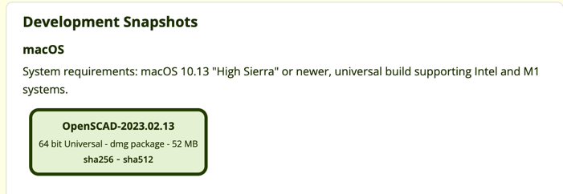

# model-customizer
Customize 3D Models

## How to Setup Openscad CLI (Mac)
- go to https://openscad.org/downloads.html
- download this beta version (more than half way down the page)   
- Install openscad app and put it in your applications folder
- run this command 
 ```sudo ln -sf /Applications/OpenSCAD.app/Contents/MacOS/OpenSCAD /usr/local/bin/openscad```
  - This creates a symlink between the bin folder and the command line tool inside the openscad application

